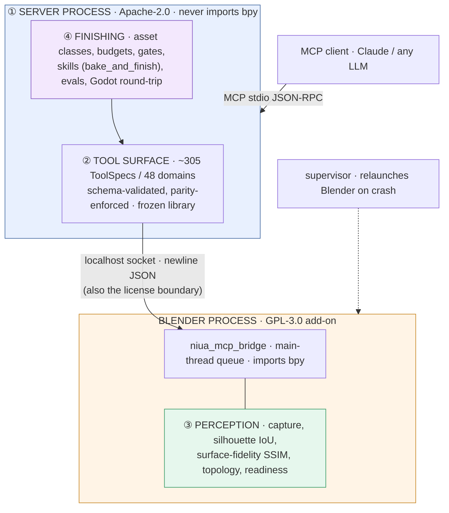
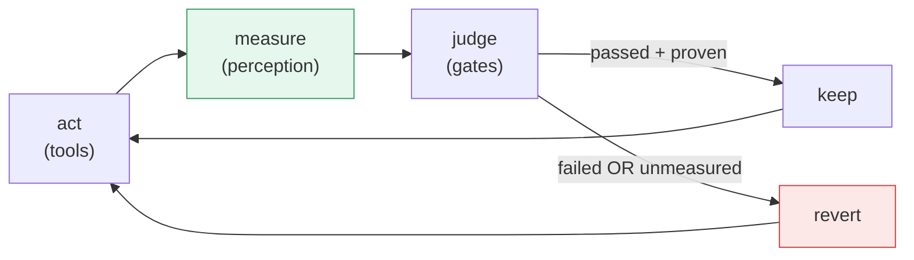

# Architecture (short)

**Lost?** Open [`START_HERE.md`](START_HERE.md) first.

## Job

```
rough mesh → game-ready-enough asset → Godot
```


*Rough mesh → driven over a socket → **measured** → verified asset. The caliper is the
point: whatever we cannot measure, we revert.*

## The system

Two processes, four strata, one loop.



### The loop that defines the product

Most Blender MCPs stop at ①+②: *can an LLM drive Blender?* Strata ③+④ answer a
different question: *can it prove the asset is shippable?*



**Hard rule:** unmeasured quality = **revert**, never a silent pass. The ruler is
deterministic and judge-free — no LLM grades its own homework.

## Two layers (the import rule)

| Layer | Question it answers | Where |
|-------|---------------------|--------|
| **Interface** | “How do I drive Blender safely?” | kernel, bridge, most `domains/`, capture |
| **Finishing** | “Is this a shippable game asset?” | `finishing/`, `evals/`, policy domains |

Two invariants, both CI-enforced:

- finishing may import interface; **interface must never import finishing** — `tests/test_layer_boundary.py`
- **the server must never import `bpy`** — `tests/test_no_bpy_in_server.py`; this one also
  keeps the two licenses separable, see [`LICENSING.md`](LICENSING.md)

## Product vs library

| You care about | Frozen library (do not grow) |
|----------------|------------------------------|
| `bake_and_finish` skill | Extra Blender domains (sequencer, UI chrome, …) |
| gates + asset classes + fidelity | RNA “list all tools” expansion |
| objective bench + Godot | Old plans under `docs/superpowers/` |

Default finisher: `evals/finisher.py` → `finishing/skills/bake_and_finish.py`.

## Keep / freeze

- **Keep improving:** retopo, bake, UV, fail-closed fidelity, multipart stability, Godot export.
- **Freeze:** new domain packs, second finishers, platform chrome — unless the product loop is blocked.

## Historical

Long design: `docs/DESIGN.md`. Build plans/specs: `docs/superpowers/` (archive).
