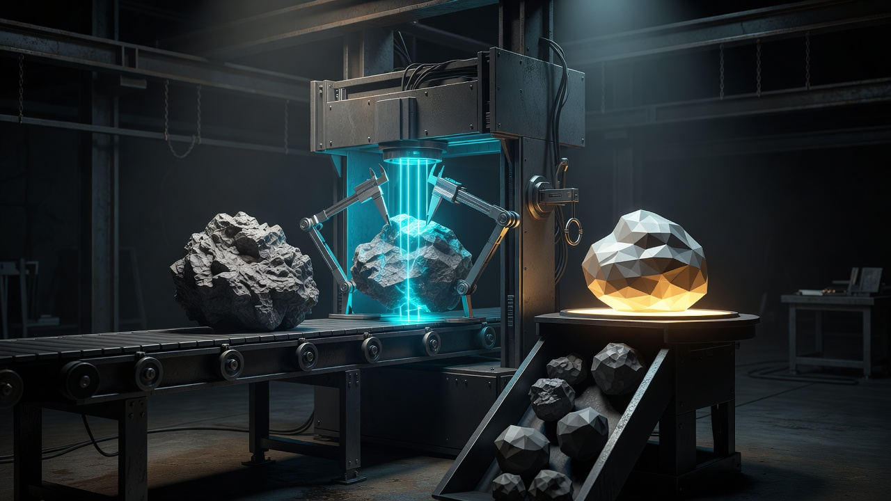
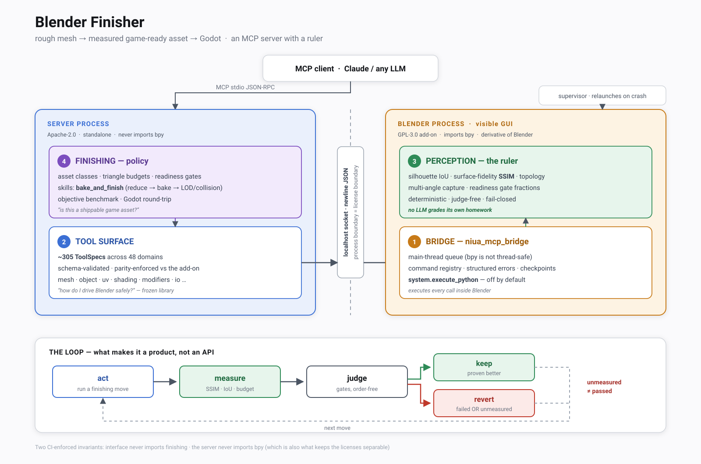

# Architecture (short)

**Lost?** Open [`START_HERE.md`](START_HERE.md) first.

## Job

```
rough mesh → game-ready-enough asset → any engine
```



Read it left to right — every part maps to something real:

| In the picture | In the system |
|---|---|
| Rough mesh on the conveyor | a dense mesh arriving from any generator, scan, or sculpt |
| **Calipers + scan beam** | `feedback.*` — silhouette IoU, surface-fidelity SSIM, topology |
| Lit pedestal, refined asset | budgeted, baked, UV'd, engine-importable glTF |
| **The reject pile** | the fail-closed rule: *unmeasured or unproven → revert* |

Most Blender integrations build the conveyor. The calipers and the reject pile are the
product.

## The system

Two processes, four strata, one loop.



Most Blender integrations stop at strata ①+② — *can an LLM drive Blender?* Strata ③+④
answer a different question: *can it prove the asset is shippable?*

**Hard rule:** unmeasured quality = **revert**, never a silent pass. The ruler is
deterministic and judge-free — no LLM grades its own homework.

## Two layers (the import rule)

| Layer | Question it answers | Where |
|-------|---------------------|--------|
| **Interface** | “How do I drive Blender safely?” | kernel, bridge, most `domains/`, capture |
| **Finishing** | “Is this a shippable game asset?” | `finishing/`, policy domains |

Two invariants, both enforced by the test suite:

- finishing may import interface; **interface must never import finishing** — `tests/test_layer_boundary.py`
- **the server must never import `bpy`** — `tests/test_no_bpy_in_server.py`; this one also
  keeps the two licenses separable, see [`LICENSING.md`](LICENSING.md)

## What is and isn't the MCP

Three kinds of content live in this repo. Only the first is the product; the other two
exist to prove the first one works and to record that it did.

| | What it is | Where | Ships to users |
|---|---|---|---|
| **The MCP** | the server + the add-on: transport, tool surface, perception, finishing policy | `src/niua_blender_mcp/` (minus `evals/`), `blender_addon/niua_mcp_bridge/` | ✅ wheel (Apache) + add-on (GPL) |
| **The harness** | how we prove it works: benchmark items, reference finisher, unit tests, dev/ops scripts | `src/niua_blender_mcp/evals/`, `tests/`, `scripts/` | ❌ |
| **The evidence** | what we proved and when: live run reports, plans, specs, design notes | `docs/reports/`, `docs/superpowers/`, `docs/DESIGN.md` | ❌ |

Three things that surprise people:

- **`evals/` sits inside the server package but is not part of it.** It is there for import
  convenience only. It is a strict leaf — nothing in the server imports it, only `tests/`
  and `scripts/` do — and `pyproject.toml` excludes it from the wheel. Developers still get
  it because pytest puts `src` on the path directly.
- **The benchmark fixtures are not in the repo.** `evals/benchmark/assets/*.glb` is ~72 MB
  of real generator output, deliberately untracked; only `MANIFEST.json` is committed.
  Without them `list_items()` returns `[]` and `load_item()` raises `KeyError` — that is
  why the harness must not ship.
- **The add-on is not in the wheel.** That is the license boundary, not an oversight — see
  [`LICENSING.md`](LICENSING.md). CI asserts the wheel contains zero add-on files.

## Whose name goes on what

The tool is *called* Niua Blender MCP, and the product wears that name: the add-on's
`bl_info`, its N-panel, its operator ids, its env vars, its distribution name.

Nothing we write into **your** file does. Datablocks injected into your scene, custom
property keys that ride along on your exported asset, files written to your disk, and
entries pushed onto your undo stack all get a functional `mcp_` prefix — `__mcp_capture_cam`,
`mcp:intake`, `mcp_decimate` — so the name says what the thing is, not who made it.
`tests/test_no_vendor_brand_in_user_data.py` enforces the line.

This is the same instinct as the layer rule: the parts of this repo that could serve any
Blender automation should carry no opinion, and no ownership, that isn't yours.

## Product vs library

| You care about | Frozen library (do not grow) |
|----------------|------------------------------|
| `bake_and_finish` skill | Extra Blender domains (sequencer, UI chrome, …) |
| gates + asset classes + fidelity | RNA “list all tools” expansion |
| objective bench + import check | Old plans under `docs/superpowers/` |

Default finisher: `evals/finisher.py` → `finishing/skills/bake_and_finish.py`.

## Keep / freeze

- **Keep improving:** retopo, bake, UV, fail-closed fidelity, multipart stability, export verification.
- **Freeze:** new domain packs, second finishers, platform chrome — unless the product loop is blocked.

## Historical

Long design: `docs/DESIGN.md`. Build plans/specs: `docs/superpowers/` (archive).
