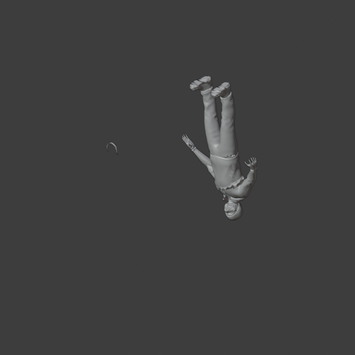
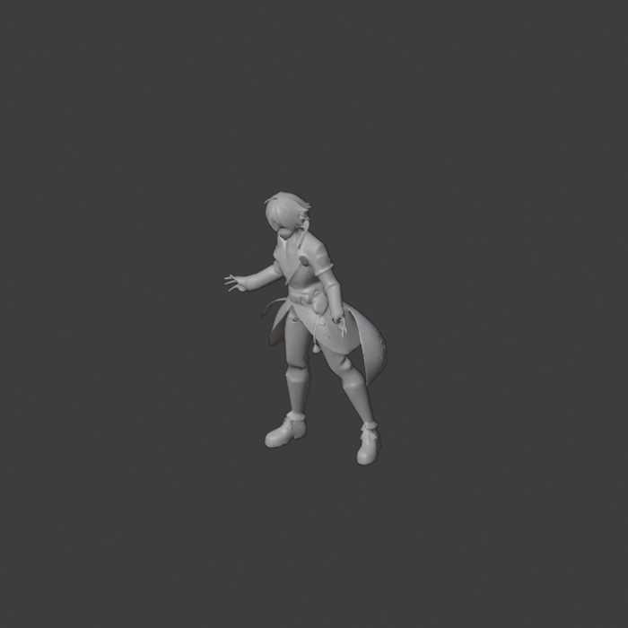

# Acceptance run — 2026-07-25 (v0.1.0)

Objective benchmark, `--mode agent`, finisher `evals.finisher:finish`, visible Blender 5.1.2,
measurement live (OpenGL). Deterministic, no LLM judge.

```
python scripts/run_objective_benchmark.py --mode agent \
  --finisher niua_blender_mcp.evals.finisher:finish --port 8765 --outdir /tmp/niua_accept
```

## Result

| asset | tris | budget | readiness | preservation | fidelity | engine import |
|---|---:|---:|---:|---:|---:|---|
| real_character | **74,889** | 18k ✖ | 0.760 | 0.926 | **0.990** | ok |
| real_character_light | 17,996 | ✓ | 0.840 | 0.999 | 0.924 | ok |
| real_creature | 17,986 | ✓ | 0.760 | 0.994 | 0.925 | ok |
| real_multipart | 18,000 | ✓ | 0.640 | 0.981 | 0.939 | ok |
| real_prop | — | — | **unmeasured** | — | — | — |

```
n_measured 4/5 · n_harm_flagged 0 · n_preservation_pass 4 · n_fully_ready 0
mean_readiness 0.75 (floor 0.85) · mean_preservation 0.975 · mean_surface_fidelity 0.945
engine import: 4 measured, 4 ok · grade INVALID (one item unmeasured)
```

## What this run settles

**1. The `real_multipart` crash is fixed.** This asset used to segfault Blender and kill the
run mid-item. It now completes, lands at *exactly* 18,000 triangles, preserves form
(0.981 / 0.939) and imports clean. Verified by eye: an intact character — limbs, fingers,
belt detail — not a blob. The pre-guard that declines voxel remesh on multi-island /
high-non-manifold input (commit `9586204`) is doing its job.



*`real_multipart`, finished: 18,000 triangles, intact. Previously crashed Blender.*

**2. Nothing was damaged.** `harm_flagged 0` across every measured asset, `preservation_pass
4/4`. Where a reducing move would have wrecked the mesh, it was reverted instead of shipped.

**3. The ruler works; the reducer is the bottleneck.** `real_character` is the clearest
case: both reduce paths were rejected —

```
bake_retopo    fid 0.330  REVERTED
bake_decimate  fid 0.274  REVERTED
```

so the asset kept a **0.990** fidelity but stayed at 74,889 triangles, 4× over budget. The


*`real_character`: fidelity 0.990, form perfectly held — and 4× over budget.*

gate was right (0.27 is garbage), and the honest reading is not "the character has surface
noise" but **"no current reducer can take this asset to budget without destroying it."**
That is a reducer problem, not a threshold problem, and no floor tweak will fix it.

**4. Nothing is `fully_ready`.** Mean readiness 0.75 against a 0.85 floor. Assets that hold
form but miss budget, or hit budget with partial gate coverage, do not clear the bar — as
intended.

## Open issues this run exposed

- **`real_prop` timed out**: `FINISHER FAILED: feedback.readiness exceeded 120.0s`. This is
  new and is an *infrastructure* failure, not a quality one — the asset was mid-pipeline and
  never got measured, which correctly invalidated the whole grade. Needs profiling of
  `feedback.readiness` on this asset (it previously finished, so this is a regression or a
  scaling cliff).
- **Grade is `INVALID`** by design: one unmeasured item means the run cannot be graded. The
  fail-closed rule applies to the benchmark itself, not only to individual moves.

## Honest summary

Of 4 measured assets: **3 finish at budget with form preserved and importing clean into a
real engine**; 1 preserves form but cannot be reduced. The 5th never finished due to a
timeout. Zero assets were harmed. Zero clear the strict full-readiness bar.

The headline change since the last run is that the crash is gone — the pipeline now
completes on every asset it measures.
